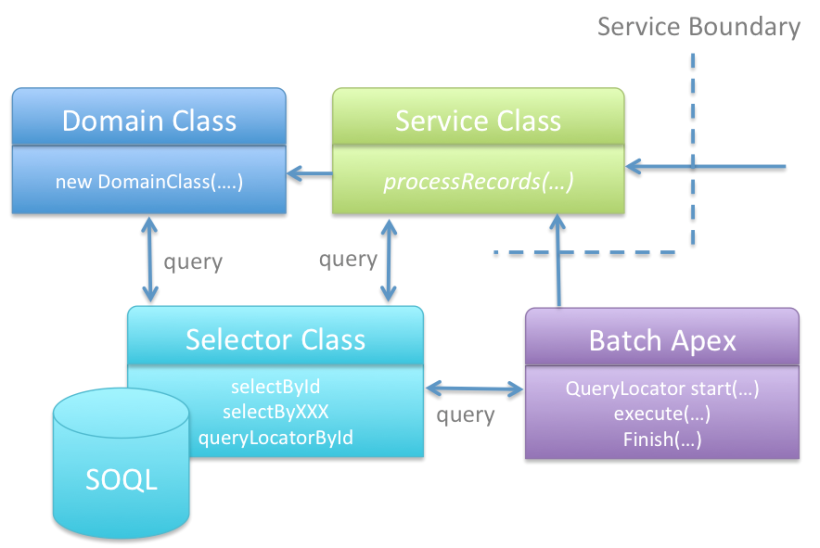

# Selector Pattern

- A class responsible for all aspects of queries for a single `SObject`
- Manages the fields to query
- Manages the specific queries
- All classes use this class to make queries against this SObject
- The pattern encourages bulkification
  - All method parameters are usually Sets of `ID`s
  - All methods return Lists of the `SObject`
- Returns List of `SObjects` or `Database.QueryLocator`

<br>

### Cons of static queries

- Difficult to maintain
  - If a new field is needed, developer has to change every instance in codebase
- Prevent "SObject row was retrieved via SOQL without querying the requested field" error
- Violates *Separation of Concerns* principle

<br>

### Implementing Selector Pattern

Classes to maintain in the "fflib-apex-common" project:
- `fflib_QueryFactory`
  - Facilitates an object oriented way to construct queries efficiently
- `fflib_SObjectSelector`
  - Abstract base class for all selector pattern classes within the application
- `fflib_ISObjectSelector`
  - Base Interface used by all selector pattern classes
  - All individual selector interfaces extend this interface


Definition:
```java
public class OpportunitiesSelector extends fflib_SObjectSelector implements IOpportunitiesSelector {
 
   public Schema.SObjectType getSObjectType() {
      return Opportunity.sObjectType;
   }
 
   public override List<Schema.SObjectField> getSObjectFieldList() {
      return new List<Schema.SObjectField> {
         Opportunity.AccountId,
         Opportunity.Id,
         Opportunity.Name,
         Opportunity.StageName
      };
   }
 
}
```

Usage:
```java
public List<Opportunity> selectById(Set<Id> recordIds) {
   return (List<Opportunity>) selectSObjectsById(recordIds);
}
```

### Naming convention

- Optional "section" prefix which denotes a module/application with underscore.
  - i.e. `eks_`
- Begins with `SObject` in plural form.
  - i.e. `Opportunities`
- Ends with `Selector`.
- Multi-SObject query support
  - i.e. `OpportunitiesSelector.selectByIdWithProducts(Set<ID> idSet)`
- Default set of classes
  - i.e. SObject = `FooBar__c`
    - `FooBarsSelector`
    - `IFooBarsSelector`
    - `FooBarsSelectorTest`
    - `FooBarsSelectorException`


### Minimum setup of a class
- Extends `fflib_SObjectSelector`
- Implements the corresponding interface
  - to support mocking
- Implements following methods:
  - `Schema.SObjectType getSObjectType()`
    - Allows the framework to understand on which SObject this selector provides
  - `List<Opportunity> selectById(Set<ID> idSet)`
  - `List<Schema.SObjectField> getSObjectFieldList()`
    - To guarantee every query that utilizes ths class will always have these fields
  - `static IOpportunitiesSelector newInstance()`
    - calls the `Application.Selector.newInstance(Opportunity.SObjectType)` and casts the instance to the ISelector interface

### Selector class
- Each selector class manages its own SObject
- Each section of query is built from `fflib_QueryFactory`
- Method relies on other selector classes for multi-object query:
  - `fflib_QuerySelector.addQueryFactorySubselect()`
  - `fflib_QuerySelector.configureQueryFactoryFields()`

```java
// OpportunitiesSelector.cls

// ...

	public List<Opportunity> selectByIdWithProducts(Set<Id> idSet)
	{
		fflib_QueryFactory opportunitiesQueryFactory = newQueryFactory();

		fflib_QueryFactory lineItemsQueryFactory = new OpportunityLineItemsSelector().addQueryFactorySubselect(opportunitiesQueryFactory);
			
		new PricebookEntriesSelector().configureQueryFactoryFields(lineItemsQueryFactory, 'PricebookEntry');
		new ProductsSelector().configureQueryFactoryFields(lineItemsQueryFactory, 'PricebookEntry.Product2');
		new PricebooksSelector().configureQueryFactoryFields(lineItemsQueryFactory, 'PricebookEntry.Pricebook2');

		return (List<Opportunity>) Database.query(opportunitiesQueryFactory.setCondition('id in :idSet').toSOQL());
	}

// ...
```

Usage:
```java
// Query Opportunities
List<Opportunity> oppRecords = OpportunitiesSelector.newInstance().selectByIdWithProducts(opportunityIds);
```

<br>



<br>

Notes:
- Selectors only access other selectors during multi-object relationship queries
- Selectors never access domains, service-tier logic, nor client-tier logic 

<br><br>
---

### References
- [FFLIB – Selector layer](https://quirkyapex.com/2016/08/18/fflib-selector-layer/)
- [FFLib Apex Common Sample](https://github.com/apex-enterprise-patterns/fflib-apex-common-samplecode)