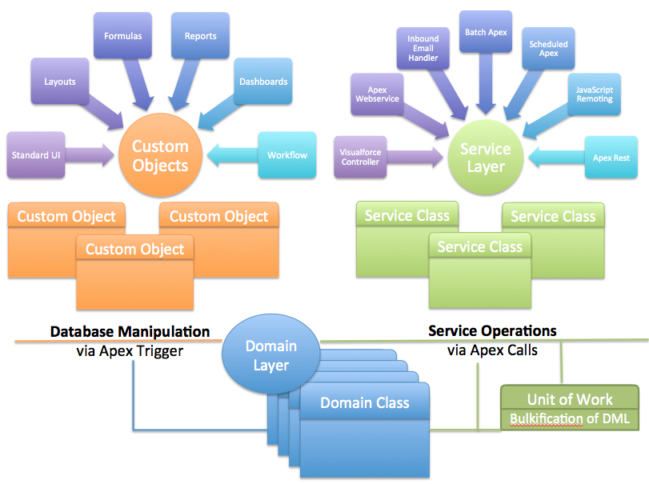

# Domain Pattern

A class responsible for the business logic specific to a single SObject.

- Referred to as “fine grain services”.
- Wrapper around the records you are working with.
  - Think of Triggers
- Initialize the domain class with all of the records of that type that you are working with in the current context.
  - This can be one to many records.
- It does not manage the persistence of records (see UnitOfWork).
- Handles defaulting and validations.
- Once you have the domain class, you work with a single object, executing logic on the records.

<br>

### Domain classes in Apex compared to other platforms

In Salesforce we cannot `extend` the sObjects and event if we could writing code that deals with a single record instance leads to governor issues. Instead the Domain class implementation uses the **composition** (also known as **wrapper class**) approach to combine record data and behavior.

We also choose to wrap a list of records to enforce **bulkified implementations**.

An instantiation of a Domain class will look like:

```java
List<Race__c> raceRecords = [select Id, Name from Races__c where Id in :raceIds];
Races races = new Races(raceRecords);
```

We won't implement methods such as `getRaces()` in Domain classes. Instead, the caller will use the Selector classes to query the required records.

<br>

## Implementing design guidelines

### Naming Convention

- **Avoid acronyms**
- **Class names**: Use the plural name of the Custom Object. i.e. `Races.cls` and `Teams.cls`.
- **Method names**: Methods that relate to the logic associated with database operations or events should follow the `onEventName` convention. Avoid repeating the name of the class as part of the name.
  - `Races.onBeforeInsert` instead of `Races.checkInserts`
  - `Races.start` instead of `Races.startRace`
- **Parameter names and types**: Passing in a list of records to the Domain class
methods is not required, this is available as a class member variable to all the
Domain class methods.
  - `Races.onBeforeInsert()` instead of `Races.onBeforeInsert(List<Race__c>racesBeingInserted)`
  - `Races.start()` instead of `Races.start(List<Id>raceIds)`
- **Inner classes and interfaces**: There is typically less of a need for inner classes representing
data to be passed in and out of a Domain class.

- Optional "section" prefix which denotes a module/application with underscore.
- Begin with SObject in plural form
  - i.e. `Accounts`, `Services__c`
- Default set of classes (for `FooBar__c` object):
  - `FooBars`
  - `IFooBars`
  - `FooBarsTest`
  - `FooBarsException`

<br>

### Bulkification

Code written in the Domain layer is encouraged to think about records in a bulk context.

Instead of enforcing bulkification through passing parameters, the information in the Domain class are its member variables, and specifically the `Records` property (the state the Domain class was constructed with).

```java
public override void onValidate() {
  for(Contestant__c race : (List<Contestant__c>) Records) {
  }
}
```

<br>

### Transaction management

In some cases though, you might want to pass other domain objects and/or a **Unit Of Work** as additional parameters. Unit of Work if needed can be created for the scope of the Domain class method execution.

<br>

### Domain class template

A basic template for a Domain class can be like the snippet below:

```java
public inherited sharing class Races extends fflib_SObjectDomain {
  public Races(List<Race__c> races) {
    super(races);
  }

  public class Constructor implements fflib_SObjectDomain.IConstructable {
    public fflib_SObjectDomain construct(List<SObject> sObjectList) {
      return new Races(sObjectList);
    }
  }
}
```

Constructor for this class takes a list of Race__c records.

Note: The inner class, `Constructor`, is present to permit the dynamic creation of the Domain class in an Apex Trigger context. This is a workaround for the lack of full reflection in Apex.

By extending the `fflib_SObjectDomain` class;

- the Domain class inherits `Records` property, which provides access to the actual record data.
- There are `virtual` methods provided to make the implementation of the Apex Trigger.
- specialized events such as `onValidate` and `onApplyDefaults`.

<br>
<br>

## Implementing Domain Trigger logic

The most common initial use case for a Domain class is to encapsulate the Apex Trigger logic. 

An Apex Trigger is required to invoke the triggerHandler method.

```java
trigger Seasons on Season__c (after delete, after insert, after update, before delete, before insert, before update) {
  fflib_SObjectDomain.triggerHandler(Seasons.class);
}
```

The mapping between Trigger events and the Trigger Handler class is as follows:

| Trigger context        | Base class records | Base class handle | Base class event |
| ---------------------- |:------------------ |:----------------- |:---------------- |
| **Trigger.isBefore**                                                               |
| `Trigger.isInsert`     | `Trigger.new`      | `handleBeforeInsert()`   | `onApplyDefaults()` <br> `onBeforeInsert()` |
| `Trigger.isUpdate`     | `Trigger.new`      | `handleBeforeUpdate(Map<Id,SObject> existingRecords)` | `onBeforeUpdate(Map<Id,SObject> existingRecords)` |
| `Trigger.isDelete`     | `Trigger.oldMap`   | `handleBeforeDelete()` | `onBeforeDelete()` |
| **Trigger.isAfter**                                                                |
| `Trigger.isInsert`     | `Trigger.new`      | `handleAfterInsert()` | `onValidate()` <br> `onAfterInsert()` |
| `Trigger.isUpdate`     | `Trigger.new`      | `handleAfterUpdate(Map<Id,SObject> existingRecords)` | `onValidate(Map<Id,SObject> existingRecords)` <br> `onAfterUpdate(Map<Id,SObject> existingRecords)` |
| `Trigger.isDelete`     | `Trigger.oldMap`   | `handleAfterDelete()` | `onAfterDelete()` |

<br>

We override the *Event* class in the Domain class. However, the *Handle* class can also be overridden to implement a custom handling.

<br>

### Enforcing object security

The **Object CRUD (Create, Read, Update, and Delete) security** has been done by default in the Domain base class handlers.

For example:

```java
public virtual void handleAfterInsert()
{
  if(Configuration.EnforcingTriggerCRUDSecurity && !SObjectDescribe.isCreateable()) 
      throw new DomainException('Permission to create an ' + SObjectDescribe.getName() + ' denied.');
      
  onValidate();
  onAfterInsert(); 
}
```

The **Field Level security** has to be implemented by the developer.

<br>

### Overriding the default behavior

Main classes to mention in the *fflib-apex-common project*:

- `fflib_SObjectDomain.cls`
- `fflib_ISObjectDomain.cls`

Sample usage:

- `Opportunities.cls`
- `IOpportunities.cls`

To make it easier to configure the `fflib_SObjectDomain` class throughout the application, a new base class is created as follows:

```java
/**
 * Application specific Domain base class,
 * customize fflib_SObjectDomain and add common behavior
 **/
public inherited sharing abstract class ApplicationDomain extends fflib_SObjectDomain {
  public ApplicationDomain(List<SObject> records) {
    super(records);
    // Disable CRUD security enforcement at the Domain class level
    Configuration.disableTriggerCRUDSecurity();
  }
}
```

Note: the implementation in *at4dx* is slightly different.

Thus, Domain classes extend the preceding `ApplicationDomain` class instead:
```java
public inherited sharing class Contestants extends ApplicationDomain {
  public Contestants(List<Contestant__c> contestants) {
    super(contestants);
  }
}
```

<br>

### Apex Trigger event handling

<br>

#### Defaulting field values on insert

The `onApplyDefaults` can be overridden to implement logic to set default values on record insert.

```java
public override void onApplyDefaults() {
  for(Driver__c driver : (List<Driver__c>) Records) {
    if(driver.ShortName__c == null) {
      // Upper case first three letters of drivers last name
      String lastName = driver.Name.substringAfterLast(' ');
      driver.ShortName__c = lastName.left(3).toUpperCase();
    }
  }
}
```

<br>

#### Validation on insert

The `onValidate()` should be overridden in order to apply validation logic.

```java
public override void onValidate() {
  // Bulk load the associated races
  Set<Id> raceIds = new Set<Id>();

  for (Contestant__c contestant : (List<Contestant__c>) Records) {
    raceIds.add(contestant.Race__c);
  }

  Map<Id, Race__c> associatedRaces = new Map<Id, Race__c>(new RacesSelector().selectById(raceIds));

  // Only new contestants to be added to Scheduled races
  for (Contestant__c contestant : (List<Contestant__c>) Records) {
    Race__c race = associatedRaces.get(contestant.Race__c);

    if (race.Status__c != 'Scheduled') {
      contestant.addError('Contestants can only be added to scheduled races');
    }
  }
}
```

The logic always invokes the after phase of the Apex Trigger to ensure complete confidence and security, as the data will not be modified
further after validation.

<br>

#### Validation on update

By overriding the `onValidate(Map<Id,SObject> existingRecords)` method we can perform Update validations.

```java
public override void onValidate(Map<Id,SObject> existingRecords) {
  // Only validate records where the Driver has been changed
  List<Contestant__c> changedDrivers = getChangedRecords(new Set<SObjectField> { Contestant__c.Driver__c });

  // Bulk load the associated races
  Map<Id, Race__c> associatedRaces = queryAssociatedRaces(changedDrivers);

  // Can only change drivers in scheduled races
  for (Contestant__c contestant : changedDrivers) {
    Race__c contestantRace = associatedRaces.get(contestant.Race__c);

    if (contestantRace.Status__c != 'Scheduled') {
      contestant.Driver__c.addError('You can only change drivers for scheduled races');
    }
  }
}
```

The `getChangedRecords` method returns only records where the specified field (i.e. `Driver__c`) has been changed.

In addition, the `queryAssociatedRaces` private method loads associated Race records.

```java
private Map<Id, Race__c> queryAssociatedRaces() {
  // Bulk load the associated races
  Set<Id> raceIds = new Set<Id>();

  for (Contestant__c contestant : (List<Contestant__c>) Records) {
    raceIds.add(contestant.Race__c);
  }

  return new Map<Id, Race__c>(new RacesSelector().selectById(raceIds));
}
```

<br>
<br>

## Implementing custom Domain logic

A Domain class should not be restricted to containing logic purely related to Apex Triggers. A piece of logic that is directly related to the the object should be placed in the Domain class and then it can be shared between other Domain and Service layer code.

```java
public void awardChampionshipPoints(fflib_ISObjectUnitOfWork uow) {
  // Apply championship points to given contestants
  Map<Integer, ChampionshipPoint__mdt> pointsByTrackPosition = new ChampionshipPointsSelector().selectAllByTrackPosition();

  for (Contestant__c contestant : (List<Contestant__c>) Records) {
    // Determine points to award for the given position
    ChampionshipPoint__mdt pointsForPosition = pointsByTrackPosition.get(Integer.valueOf(contestant.RacePosition__c));

    if (pointsForPosition!=null) {
      // Apply points and register for udpate with uow
      contestant.ChampionshipPoints__c = pointsForPosition.PointsAwarded__c;
      uow.registerDirty(contestant);
    }
  }
 }
```

Note: the Unit Of Work is passed as a parameter here so that the method can register work. The calling Service layer method responsible for committing the work.

<br>
<br>

## Object-oriented programming

By using an Apex Interface and a generic service, we separate the functional concerns as follows:

- The **Service layer** code is concerned solely with executing the checking process through the interface.
- The **Controller** code is concerned with calling the service class method to execute the check and then presenting the results to the user consistently.
- The **Domain layer** classes that implement the interface focus solely on validating the record data against the applicable rules according to the type of the object.

With an Apex Interface, we can define any common requirement for the applicable Domain classes to implement.

For instance, if a Domain class should verify a set of Compliance.

```java
public with sharing class ComplianceService {
  /**
  * Interface used to execute compliance checking logic
  * in each domain class
  **/
  public interface ICompliant {
    List<VerifyResult>verifyCompliance();
  }

  /**
  * Results of a compliance verification for a given record
  **/
  public class VerifyResult {
    public Id recordId;
    public String complianceCode;
    public Boolean passed;
    public String failureReason;
  }
}
```

Then the Domain class `Drivers` can implement this interface:

```java
public inherited sharing class Drivers extends ApplicationDomain implements ComplianceService.ICompliant {

  public List<ComplianceService.VerifyResult> verifyCompliance() {
    // ...
  }

  // ...
}
```

<br>
<br>

## Testing the Domain layer

<br>

### Test methods using DML and SOQL

To test **Apex Trigger** methods on Domain, the traditional use of DML and SOQL can be applied alongside the use of the Apex runtime `DMLException` methods to assert not only the error message but also other details.

```java
@IsTest
private static void testAddContestantNoneScheduled() {
  // Test data
  Season__c season = new Season__c(Name = '2014', Year__c = '2014');
  insert season;

  Driver__c driver = new Driver__c(Name = 'Lewis Hamilton', DriverId__c = '42');
  insert driver;

  Race__c race = new Race__c(Name = 'Spa', Status__c = 'In Progress', Season__c = season.Id);
  insert race;

  Test.startTest();

  try {
    // Insert Contestant to In Progress race
    Contestant__c contestant = new Contestant__c(Driver__c = driver.Id, Race__c = race.Id);
    insert contestant;

    System.assert(false, 'Expected exception');
  }
  catch (DMLException e) {
    System.assertEquals(1, e.getNumDml());
    System.assertEquals('Contestants can only be added to Scheduled Races.', e.getDmlMessage(0));
    System.assertEquals(StatusCode.FIELD_CUSTOM_VALIDATION_EXCEPTION, e.getDmlType(0));

    // to assert field level information
    System.assertEquals(Contestant__c.Driver__c, e.getDmlFields(0)[0]);

  }

  Test.stopTest();
}
```

The Domain class logic was tested indirectly by observing the outcome of inserting and updating records into the database.

<br>

### Test methods using the Domain class methods

To test **custom Domain class methods**, an instance of the Domain class should be created in the test method, using test records created in memory or queried from the database having been inserted.

```java
@IsTest
private static void testAddChampionshipPoints() {
  // Test data
  ChampionshipPoints__c championShipPoints = new ChampionshipPoints__c(Name = '1', PointsAwarded__c = 25);
  insert championShipPoints;

  Season__c season = new Season__c(Name = '2014', Year__c = '2014');
  insert season;

  Driver__c driver = new Driver__c(Name = 'Lewis Hamilton', DriverId__c = '42');
  insert driver;

  Race__c race = new Race__c(Name = 'Spa', Status__c = 'Scheduled', Season__c = season.Id);
  insert race;

  Contestant__c contestant = new Contestant__c(Driver__c = driver.Id, Race__c = race.Id);
  insert contestant;

  race.Status__c = 'Finished';
  update race;

  contestant.RacePosition__c = 1;
  update contestant;

  Test.startTest();

  Contestants contestants = new Contestants(new List<Contestant__c> { contestant });
  contestants.awardChampionshipPoints(Application.UnitOfWork.newInstance());
  System.assertEquals(25, ((Contestant__c) contestants.Records[0]).ChampionshipPoints__c);

  Test.stopTest();
}
```

Note: the test creates a temporary Unit Of Work, but does not commit the work.
Note: Performing SOQL and DML in tests is expensive in terms of CPU time and adds to the overall time it takes to execute all application tests.

<br>
<br>

## Calling the Domain layer

Domain classes should not be called directly from the execution context code.

Restrict your Domain class callers to the following contexts only:

- **Apex Triggers**: This calls via the `fflib_SObjectDomain.handleTrigger` method.
- **Service layer**: This layer directly creates an instance of a Domain class via the
new operator or through the Domain factory approach. Typically, the Domain class custom methods are called in this context.
- **Domain layer**: Other Domain classes can call other Domain classes.

<br>
<br>

### Minimum setup of a domain class

- Extends `fflib_SObjectDomain`
- Implements the corresponding interface
  - To support mocking
- Implements following methods:
  - Define class constructor tp pass the list of records
  - `public static IOpportunities newInstance(List<Opportunity> recordList)`
    - calls the "Application.Domain.newInstance(recordList)"e
  - `public static IOpportunities newInstance(Set<Id> recordIdSet)`
    - calls the "Application.Domain.newInstance(recordIdSet)"
- Override as needed parent class methods
  - onApplyDefaults()
  - onValidate()
  - onValidate(Map<Id, SObject> existingRecords)
  - onAfterInsert(), onAfterUpdate(), onBeforeInsert(), onBeforeUpdate()
- Add methods that execute some change or logic to records
  - i.e. `applyDiscount(Decimal discountPercentage, fflib_ISObjectUnitOfWork uow)`
    - The records were loaded when the class was instantiated
    - If the method will make changes to records that eventually need to be saved, ass a `uow` parameter.
- Add an inner "Constructor" class
  - Needed for the Apex Common trigger handler logic
    ```java

  	public class Constructor implements fflib_SObjectDomain.IConstructable
    {
      public fflib_SObjectDomain construct(List<SObject> sObjectList)
      {
        return new Opportunities(sObjectList);
      }
    }
    ```

- Trigger Framework hooks
  - Apex Commons Trigegr framework uses the Domain classes as the "Trigger Handler" via the inner Constructor" class
- Trigger setup for each SObject:
  - Setup for all events
  - Call the fflib_SObjectDomain's `triggerHandler` method:
  - 
    ```java
    // Opportunities.trigger
    trigger Opportunities on Opportunity (
	after delete, after insert, after update, before delete, before insert, before update) 
    {
        fflib_SObjectDomain.triggerHandler(Opportunities.class);
    }
    ```

<br>



<br>

Notes:

- Domains typically only reference other domains
- Domains sometimes call selector classes for other SObjects
- Domains never call Service tier logic not Client tier logic
- `fflib_SObjectDomain.Test.Database` inner class
  - Serves as a mock database to simulate trigger events without having to save records to the actual database
  - Works nicely with ApexMocks