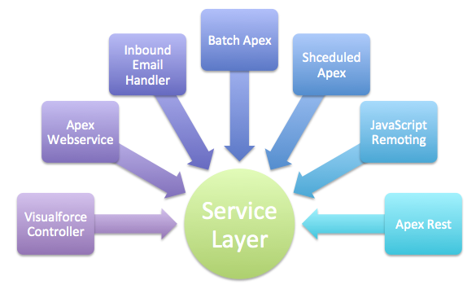

# Service Pattern

Responsible for aggregating the logic across multiple SObjects

- Referred to as a “*course-grained service*”
- It's the traditional “Service Tier Contract” boundary
- All Presentation or “*client-tier*” logic calls the Service Tier logic
  - Typically, the “client-tier” logic only calls a single Service method per transaction
- Becomes the DML Transaction boundary by utilizing a UnitOfWork

<br>



<br>

### Classes to mention in the *fflib-apex-common*
- No core classes needed from the Apex Commons framework
- This is a programming convention of Salesforce Lightning Enterprise Patterns

<br>

### Examples in the fflib-apex-common-samplecode project
- Service facade: `OpportunitiesService.cls`
- Service interface: `IOpportunitiesService.cls`
- Service implementation: `OpportunitiesServiceImpl.cls`

In addition we require:
- Unit test: `OpportunitiesServiceTest.cls`
- Exception handling: `OpportunitiesServiceException.cls`

<br>

### Naming convention
- Service facade
  - Optional "section" prefix - which denoted a module/application - with underscore.
  - Usually some subject concern (not necessarily a SObject)
  - Ends with "Service"
- Service interface
  - Same as Service facade but begins with "I"
- Service implementation
  - Same as Service facade but add "Impl" as suffix

<br>

### Minimum Setup
- Service facade
  - All methods are bulkified
    - Record Id parameters are `Set<Id>`
  - All methods all static
    - Calls Implementation methods
  - `private static IOpportunitiesService service()` method
    - calls `Application.Service.newInstance()` method
- Service interface
  - Simple interface with specific methods
  - Methods defined mirror those found in service facade
  - Dependency injection
  - Service locator pattern
- Service implementation
  - Implements the service interface class
    ```java
    public class OpportunitiesServiceImpl implements IOpportunitiesService {}
    ```

Notes:
- Service implementations:
  - call other service facades
  - call domains
  - call selectors
- Service implementations instantiate UOWs

Unit Of Work, hold and collect all the data that have changed by Service methods and commits the changes at the end.