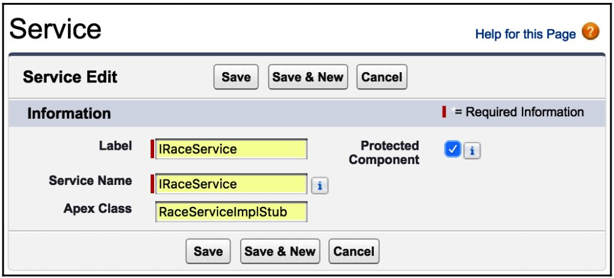

# Service Pattern

Responsible for aggregating the logic across multiple SObjects. One concern of this layer is interacting with the database.

- Referred to as a “*course-grained service*”
- It's the traditional “Service Tier Contract” boundary
- All Presentation or “*client-tier*” logic calls the Service Tier logic
  - Typically, the “client-tier” logic only calls a single Service method per transaction
- Becomes the DML Transaction boundary by utilizing a UnitOfWork

Boundary represents the point of separation or boundary between the concerns of the application's business logic (i.e. Lightning Component Controller class or a Batch Apex class).

<br>


<br>

Service layer is agnostic of the caller, easy to locate, and encourages some Lightning Platform best practices, such as bulkification.

<br>

### Classes to mention in the *fflib-apex-common*
- No core classes needed from the Apex Commons framework
- This is a programming convention of Salesforce Lightning Enterprise Patterns

<br>

### Examples in the fflib-apex-common-samplecode project
- Service facade: `OpportunitiesService.cls`
- Service interface: `IOpportunitiesService.cls`
- Service implementation: `OpportunitiesServiceImpl.cls`

In addition we require:
- Unit test: `OpportunitiesServiceTest.cls`
- Exception handling: `OpportunitiesServiceException.cls`

<br>

### Naming convention
- Service facade
  - Optional "section" prefix - which denoted a module/application - with underscore.
  - Usually some subject concern (not necessarily a SObject)
  - Ends with "Service"
- Service interface
  - Same as Service facade but begins with "I"
- Service implementation
  - Same as Service facade but add "Impl" as suffix

Note:

- Avoid acronyms
- A good `Map` naming pattern is: `somethingABySomethingB`

Good class examples:

- `CommonService`, `RaceService`, and `SeasonService`
Bad class examples:
- `UtilService`, `RaceHelper`, `BatchApexService`, and `CalcRacePointsService`

Good method examples:

- `RaceService.awardChampionshipPoints`, `SeasonService.issueNewsLetter`, and
`DriverService.issueWarnings`
Bad method examples:
- `RaceService.recalcPointsOnSave`, `SeasonService.handleScheduler`, and `SeasonService.issueWarnings`

Good parameter examples:

- `Set<Id> driverIds` and `Map<String, DrivePerformance> drivePerformanceByName`
Bad parameter examples:
- `List<String> driverList` and `Map<String, DriverPerformance> mapOfPerformance`

Good inner class examples:

- `SeasonService.SeasonSummary` and `DriverService.DriverRaceData`
Bad inner class examples:
- `SeasonService.Summary` and `DriverService.RaceDetails`

<br>

### Minimum Setup
- Service facade
  - All methods are bulkified
    - Record Id parameters are `Set<Id>`
  - All methods all static
    - Calls Implementation methods
  - `private static IOpportunitiesService service()` method
    - calls `Application.Service.newInstance()` method
- Service interface
  - Simple interface with specific methods
  - Methods defined mirror those found in service facade
  - Dependency injection
  - Service locator pattern
- Service implementation
  - Implements the service interface class
    ```java
    public class OpportunitiesServiceImpl implements IOpportunitiesService {}
    ```

Notes:
- Service implementations:
  - call other service facades
  - call domains
  - call selectors
- Service implementations instantiate UOWs

Unit Of Work, hold and collect all the data that have changed by Service methods and commits the changes at the end.

<br>
<br>

### Bulkification

A best practice for Apex Triggers, Controllers and Batch classes is to receive and process many records of the same type - bulkified.

Handling bulk sets of records is a common requirement.

```java
RaceService.awardChampionShipPoints(Set<Id>raceIds)
```

*Note*: this should not be seen as a fixed guideline, but should at least always be
considered.

<br>
<br>

### Defining and passing data

While defining data to be exchanged between the Service layer and its callers, keep in mind
that the responsibility of the Service layer is to be caller-agnostic.

- Avoid returning information through JSON or XML strings

Allow the caller to deal with that kinds of data-marshaling requirements (unless explicitly
developing functionalities for such data formats).

*Note*: multiple parameters can utilize an Apex inner class, but with consideration. Because it is not always clear which variable should be populated.

```java
public static Map<Id, List<ProvisionalResult>> calculateProvisionalResults(Set<Id>raceIds)
{
  // Implementation
}

public static void applyRaceResults(Map<Id, List<ProvisionalResult>> provisionalResultsByRaceId)
{
  //Implementation
}

public class ProvisionalResult {
  public Integer racePosition {get; set;}
  public Id contestantId {get; set;}
  public String contestantName {get; private set;}
}
```

In the code above, the `contestantName` is read-only, thus indicating that it is not a required variable.

Also, in the code below:

```java
RaceService.awardChampionShipPoints(List<Race__c> races)
```

The client has to query and provide a whole object and in addition it's not known which fields are required. This version is more acceptable:

```java
RaceService.awardChampionShipPoints(Set<Id> raceIds)
```

You might need to validate the incomming Id type though.

<br>

### Transaction management

Service method should return a failure message in case an exception occurred. In addition, it should rollback all saved data.

```java
public static void awardChampionshipPoints(Set<Id> raceIds) {
  // Mark the state of the database
  System.SavepointserviceSavePoint = Database.setSavePoint();

  try {
    // Do some work
  } catch (Exception e) {
    // Rollback any data written before the exception
    Database.rollback(serviceSavePoint);
    // Pass the exception on for the caller to handle
    throw e;
  }
}
```

**Unit Of Work** pattern, can helps manage the Service layer transaction management in a more elegant way.

<br>

### Compound services

In This code:

```java
try {
  Set<Id> seasons = new Set<Id> { seasonId };
  SeasonService.updateStandings(seasons);
  SeasonService.issueNewsLetters(seasons);
}
catch (Exception e) {
  // Handle exception...
}
```

The functionality has been moved to controller (caller of service). Also, we won't be able to Rollback saved data in case an error happened in the second method.

Therefore, we can refactor it to provides a compound service:

```java
try {
  SeasonService.UpdateStandings updateStandings = new SeasonService.UpdateStandings();
  updateStandings.seasonId = seasonId;
  updateStandings.issueNewsletter = true;

  SeasonService.updateStandings(new List <SeasonService.UpdateStandings> { updateStandings });
}
catch (Exception e) {
  // Handle exception...
}
```
<br>

### Services calling services

Services can call other services in order to reuse code.

```java
public static void awardChampionshipPoints(Set<Id>raceIds){
  fflib_SObjectUnitOfWorkuow = Application.UnitOfWork.newInstance();

  // Query Races and contestants, bulkify contestants
  List<Contestant__c> contestants = new List<Contestant__c>();

  For(Race__c race : new RacesSelector().selectByIdWithContestants(raceIds)) {
    contestants.addAll(race.Contestants__r);
  }

  // Delegate to contestant service
  ContestantService.awardChampionshipPoints(uow, contestants);

  // Commit work
  uow.commitWork();
}
```

Note: Selector pattern is discussed in chapter 1
Note: Unit Of Work pattern is discussed in chapter 5

The `ContestantService` class expose an overloaded method for `awardChampionshipPoints` so it can be called from controllers without passing the Unit Of Work instance.

```java
public static void awardChampionshipPoints(Set<Id> contestantIds)
{
  fflib_ISObjectUnitOfWork uow = Application.UnitOfWork.newInstance();

  // Apply championship points to selected contestants
  awardChampionshipPoints(uow, new ContestantsSelector().selectById(contestantIds));
  uow.commitWork();
}
public static void awardChampionshipPoints(fflib_ISObjectUnitOfWork uow, List<Contestant__c> contestants)
{
  // Apply championship points to given contestants
  Map<Integer, ChampionshipPoint__mdt> pointsByTrackPosition = new ChampionshipPointsSelector().selectAllByTrackPosition();

  for(Contestant__c contestant : contestants) {
    // Determine points to award for the given position
    ChampionshipPoint__mdt pointsForPosition = pointsByTrackPosition.get(Integer.valueOf (contestant.RacePosition__c));

    if(pointsForPosition!=null) {
      // Apply points and register for udpate with uow
      contestant.ChampionshipPoints__c =
      pointsForPosition.PointsAwarded__c;
      uow.registerDirty(contestant);
    }
  }
}
```
<br>

### Contract-Driven Development

Development teams can agree on a type of contract for development so the client can start coding by using the contract (interface) while the other team implements the functionality.

The first thing they do within the service class is create an Apex *Interface* that describes the
Service methods, which is the *contract*.

```java
public interface IRaceService {
  Map<Id, List<RaceService.ProvisionalResult>> calculateProvisionResults(Set<Id>raceIds);
  void applyRaceResults(Map<Id, List<RaceService.ProvisionalResult>> provisionalResultsByRaceId);
  void awardChampionshipPoints(Set<Id>raceIds);
}
```

The teams can create an **Stub** implementations of this contract so it can be used by client codes.

```java
public class RaceServiceImplStub implements IRaceService {

  public Map<Id, List<RaceService.ProvisionalResult>> calculateProvisionResults(Set<Id>raceIds) {

    // Dummy behavior to allow callers of the service be developed
    // independent of the main service implementation
    Id raceId = new List<Id>(raceIds)[0];

    RaceService.ProvisionalResult hamilton = new RaceService.ProvisionalResult();
    hamilton.racePosition = 1;
    hamilton.contestantName = 'Lewis Hamilton';
    hamilton.contestantId = 'a03b0000006WVph';

    RaceService.ProvisionalResult rubens = new RaceService.ProvisionalResult();
    rubens.racePosition = 2;
    rubens.contestantName = 'Rubens Barrichello';
    rubens.contestantId = 'a03b00000072xx9';

    return new Map<Id, List<RaceService.ProvisionalResult>> {
      new List<Id>(raceIds)[0] => new List<RaceService.ProvisionalResult> { hamilton, rubens }
    };
  }

  public void applyRaceResults (Map<Id,List<RaceService.ProvisionalResult>> provisionalResultsByRaceId) {
    throw new RaceService.RaceServiceException('Not implemented');
  }

  public void awardChampionshipPoints(Set<Id> raceIds) {
    throw new RaceService.RaceServiceException('Not implemented');
  }
}
```

The real implementation can just throw an exception if called - until the development is finished.

```java
public class RaceServiceImpl implements IRaceService {

  public Map<Id, List<RaceService.ProvisionalResult>> calculateProvisionResults(Set<Id> raceIds) {
    throw new RaceService.RaceServiceException('Not implemented');
  }

  public void applyRaceResults(Map<Id,List<RaceService.ProvisionalResult> provisionalResultsByRaceId) {
    throw new RaceService.RaceServiceException('Not implemented');
  }

  public void awardChampionshipPoints(Set<Id> raceIds) {
    fflib_ISObjectUnitOfWorkuow = Application.UnitOfWork.newInstance();

    // Query Races and contestants
    List<Contestant__c> contestants = new List<Contestant__c>();

    for(Race__c race : new RacesSelector().selectByIdWithContestants(raceIds))
    {
      contestants.addAll(race.Contestants__r);
    }

    // Delegate to contestant service
    ContestantService.awardChampionshipPoints(uow, contestants);

    // Commit work
    uow.commitWork();
  }
}
```

The standard `Service` class will be used to resolve the correct implementation of the `Service` methods to use.

```java
public with sharing class RaceService {

  public static Map<Id, List<ProvisionalResult>> calculateProvisionResults(Set<Id> raceIds) {
    return service().calculateProvisionResults(raceIds);
  }

  public static void applyRaceResults(Map<Id, List<ProvisionalResult>> provisionalResultsByRaceId) {
    service().applyRaceResults(provisionalResultsByRaceId);
  }

  public static void awardChampionshipPoints(Set<Id> raceIds) {
    service().awardChampionshipPoints(raceIds);
  }

  private static IRaceService service() {
    return (IRaceService) Application.Service.newInstance(IRaceService.class);
  }

  public class RaceServiceException extends Exception {}

  public class ProvisionalResult {
    public Integer racePosition {get; set;}
    public Id contestantId {get; set;}
    public String contestantName {get; set;}
  }
}
```

`Service` factory has been used to allow the actual implementation of the IRaceService interface to vary at runtime.

```java
public class Application {

  // Configure and create the ServiceFactory for this Application
  public static final fflib_Application.ServiceFactory Service = new Application.ServiceFactory(
    new Map<Type, Type> {
      IRaceService.class => RaceServiceImpl.class 
    });
```

The default is to use the `RaceServiceImpl` class. However, by inserting a record in the Services Custom Metadata Type object this can be overridden.

```java
  // Customized Service factory overrides via Custom Metadata
  private class ServiceFactory extends fflib_Application.ServiceFactory {
    private Map<String, String> servicesByClassName = new Map<String, String>();

    public ServiceFactory(Map<Type,Type> serviceInterfaceTypeByServiceImplType) {
      super(serviceInterfaceTypeByServiceImplType);

      // Map of overridden services defined by the developer
      for(Service__mdt serviceOverride : [select DeveloperName, NamespacePrefix, ApexClass__c from Service__mdt]) {
        servicesByClassName.put(serviceOverride.NamespacePrefix + '.' + serviceOverride.DeveloperName, serviceOverride.ApexClass__c);
      }
    }

  public override Object newInstance(Type serviceInterfaceType) {
    // Has the developer overridden the Service impl?
    if(!Test.isRunningTest() && servicesByClassName.containsKey(serviceInterfaceType.getName())) {
      String overridenServiceImpl = servicesByClassName.get( serviceInterfaceType.getName());
      return Type.forName(overridenServiceImpl).newInstance();
    }

    // Base factory returns mocked or registered impl
    return super.newInstance(serviceInterfaceType);
    }
  }
}
```

By creating the following Custom Metadata record, the client developers can configure the application to use the stub implementation without making any code changes:

<br>



<br>
<br>
