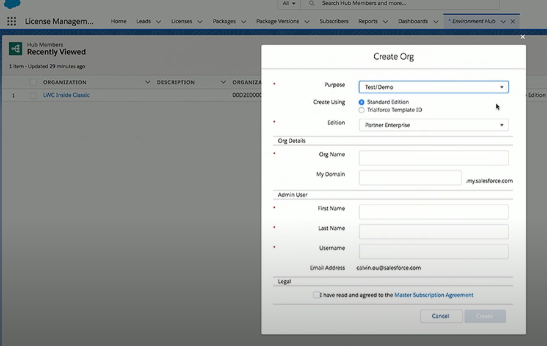
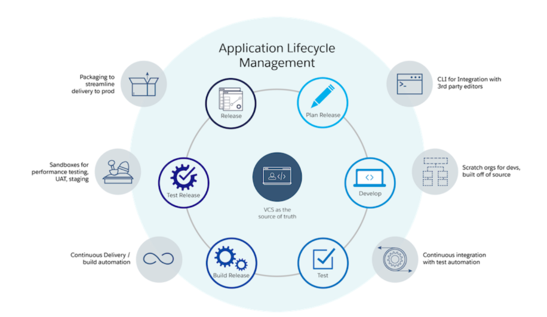

# Org Types

## Customer
- Sandboxes - staging and testing
- Production

## ISV Business
- PBO
- LMO
- Environment Hub
- Partner Community

## Development and Testing
- Dev Hub
- DX Scratch Orgs
- Dev Orgs
- Packaging Orgs
- Trailforce

 

Depending on lifecycle these orgs will be used:

| Org         | Usage |
| ----------- | ----------- |
| Production  | Put your critical apps and data |
| Developer   | Build your solution. You can also use Scratch orgs |
| Packaging   | Package your solution for distribution (Partner Developer Edition org is recommended) |
| Test        | Test your solution (create Test org based on edition or use Scratch orgs |
| Demo        | Show off your solution to prospective customers (based on a standard Salesforce environment) |
| Trial       | Let customers experience your solution firsthand |
| Sandbox     | Test functionality created by others (a copy of a production org and provides a realistic environment) |

 

---
## Run your business

### PBO (Partner Business Org)
- A special type of production org.
- PBO allows you to run your business.
- It is the command center to operate the tools used to keep the AppExchange Partnership on course from a business perspective.

 

- Inside PBO you will find:
  - **LMA** (License Management App)
    - Manage leads and licenses for the AppExchange offering
  - **COA** (Channel Order App)
    - Create, submit and track orders with Salesforce
  - **CMA** (Checkout Management App)
  - **Environment Hub**
    - Spin-up product-ready orgs to test the app in varying Salesforce editions
  - **Developer Hub**
    - Create and manage Salesforce DX scratch orgs for developmen
  - **Subscriber Support Console**

There is another org called: **Partner Developer Edition Org** which can be used for Technical aspects of your AppExchange partnership.

 

#### LMA: a PBO App
- Manage Licenses
- Leads and Listings
- Licenses for installs
- Support COnsole
- Linked with MFA (Feature Management App)

 

#### COA: a PBO App
- Submit Orders
- Contract Terms
- Revenue Sharing
- Product Catalogue

* Note: not all partners use COA

 

---
### Develop and Test
Environment Hub and Developer Hub allow you to:
- Plan
- Code
- Build
- Test
- Release

They also allow:
- CLI for integration with 3rd party editors
- IDEs, Text Editors, Language Services
- Scratch orgs for dev, built off of source
- Continues integration with test automation
- Packaging to streamline delivery to prod
- Sandboxes for performance testing, UAT, Staging
- Continues delivery/ Build automation

 

#### Developer Hub
Spin up Scratch Orgs

- Included with PBO
- Authorize SFDX Scratch Org
- Source-Driven Development
- CLI Automation
- Develop and Test with CI/CD
- Org Shaping Configuration

 

#### Environment Hub: a PBO App
Spin up actual orgs that are related to Salesforce production orgs
- Create Test/Demo orgs
- Packaging Orgs
- Connect Orgs
- Login and SSO

 

---
### Package and List
Packaging Org (Golden Package Org) created by Environment Hub.

Packaging org allows to:
- Register package namespace
- Install new package version
- Linked to AppExchange

 

---
### Security Review
You need to spin up a Partner Edition Org from Environment Hub.

Partner Edition Org will be an exact copy of Golden Package Org.

 

---
### Deliver Trials
Trial allows customers to test drive application before buying them.

#### TSO - Trial Source Orgs
- Generated from EnvHub/TMO (Trial Manage Org)
- Create templates preconfigured with sample data
- Curated for specific customers

 

---

## Development Lifecycle

| Stage       | Tools and Resources |
| ----------- | ------------------- |
| Plan        | The Partner Community |
| Build       | Environment Hub & Salesforce DX |
| Distribute  | Publishing Console |
| Market      | License Management App |
| Sell        | Channel Order App & Checkout Management App |
| Support     | Push Upgrades & Subscriber Support Console |

---

### References
- [Salesforce Developers - EnvHub, DevHub, Trials, Oh My! ! Org Best Practices for ISVs](https://www.youtube.com/watch?v=PsjfNAfbSbc)
- [Take Advantage of Tools and Resources for AppExchange Partners](https://trailhead.salesforce.com/en/content/learn/modules/isvforce_basics/isvforce_basics_tools_resources)
